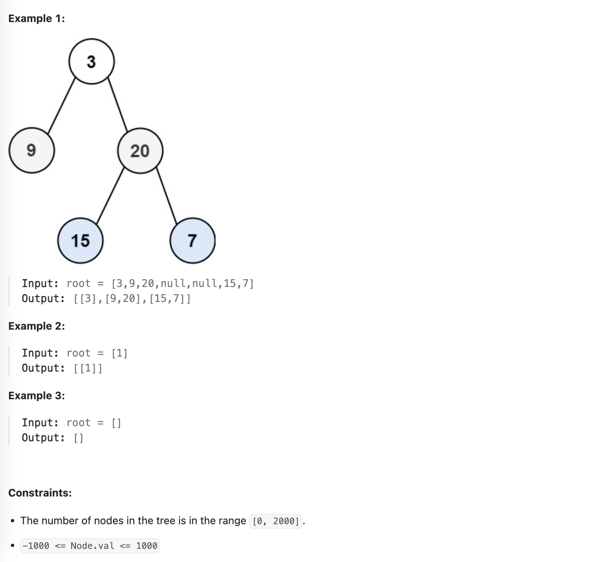

# [102. Binary Tree Level Order Traversal](https://leetcode.com/problems/binary-tree-level-order-traversal/description/)

Medium

Given the `root` of a binary tree, return *the level order traversal of its nodes' values.* (i.e., from left to right, level by level).

