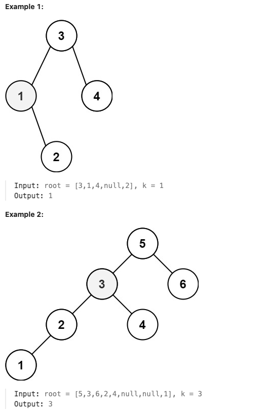

# [230. Kth Smallest Element in a BST](https://leetcode.com/problems/kth-smallest-element-in-a-bst/description/)

Medium

Given the `root` of a binary search tree, and an integer `k`, return the $k^{th}$ smallest value *(**1-indexed**)* of all the values of the nodes in the tree.

There is only **one repeated number** in `nums`, return this repeated number.

You must solve the problem **without** modifying the array `nums` and using only constant extra space. 

**Constraints:**

- The number of nodes in the tree is `n`.
- $1 <= k <= n <= 10^4$
- $0 <= Node.val <= 10^4$
 

**Follow up:** If the BST is modified often (i.e., we can do insert and delete operations) and you need to find the kth smallest frequently, how would you optimize?