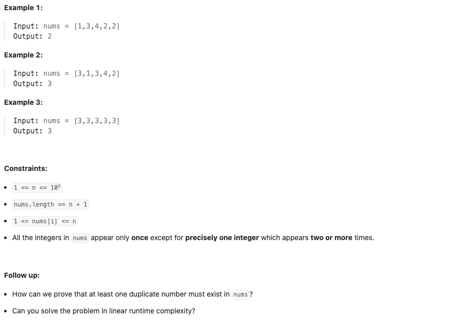

# [287. Find the Duplicate Number](https://leetcode.com/problems/find-the-duplicate-number/description/)

Medium

Given an array of integers `nums` containing n + 1 integers where each integer is in the range `[1, n]` inclusive.

There is only **one repeated number** in `nums`, return this repeated number.

You must solve the problem **without** modifying the array `nums` and using only constant extra space. 

