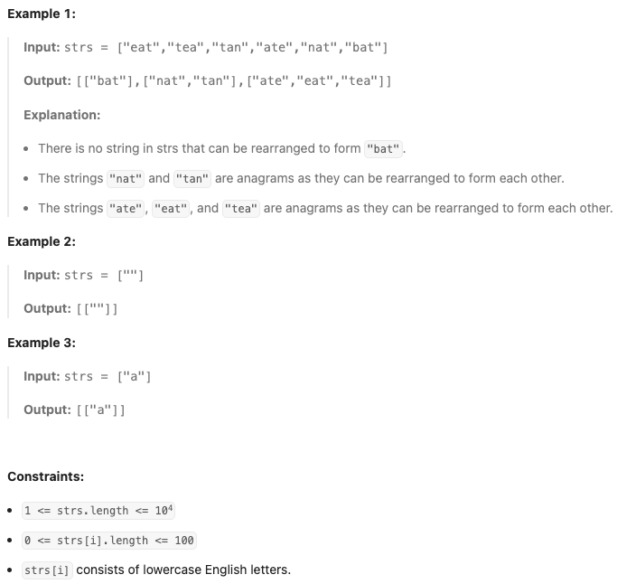

# [49. Group Anagrams](https://leetcode.com/problems/group-anagrams/description/)

Medium

Given an array of strings `strs`, group the [anagrams](./anagrams) together. You can return the answer in `any order`.

