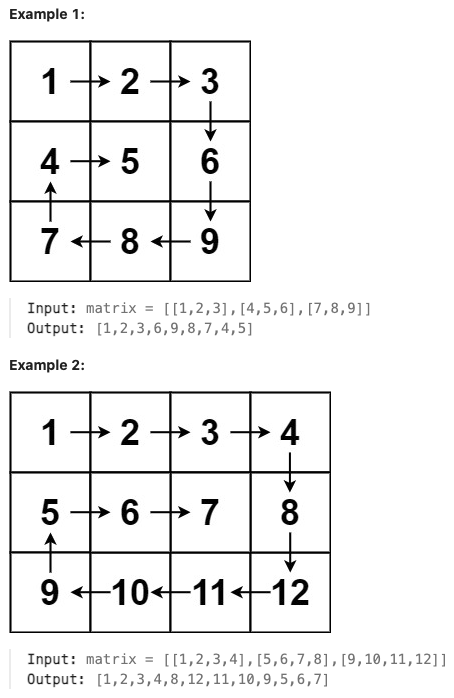

# [54. Spiral Matrix](https://leetcode.com/problems/spiral-matrix/description/)

Medium

Given an `m x n` matrix, return *all elements of the* `matrix` *in spiral order*.

**Constraints:**

- `m == matrix.length`
- `n == matrix[i].length`
- `1 <= m, n <= 10`
- `-100 <= matrix[i][j] <= 100`